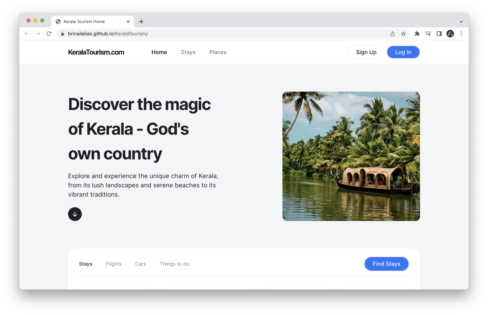

# Kerala Tourism

  <a href="#">About The Project</a>&nbsp;&nbsp;&nbsp;|&nbsp;&nbsp;&nbsp;
  <a href="#">Technologies</a>&nbsp;&nbsp;&nbsp;|&nbsp;&nbsp;&nbsp;
  <a href="#">Running the Project</a>

---

## 🚀 About the Project

KeralaTourism.com is a complete redesign of Kerala Tourism website using HTML and CSS. The new website is more user-friendly and visually appealing, and it provides visitors with more information about the state of Kerala. The website is also mobile-friendly, so visitors can access it from their smartphones and tablets.

---
## 💻 Technologies
- [HTML5](https://developer.mozilla.org/en-US/docs/Glossary/HTML5)
- [CSS3](https://developer.mozilla.org/en-US/docs/Web/CSS)
- [VS Code](https://code.visualstudio.com) and [Prettier RC](https://github.com/prettier/prettier)

---

##  Running the project
Visit this link: [KeralaTourism.com](brinsilelias.github.io/KeralaTourism/) and enjoy the magic of god's own country.

---

